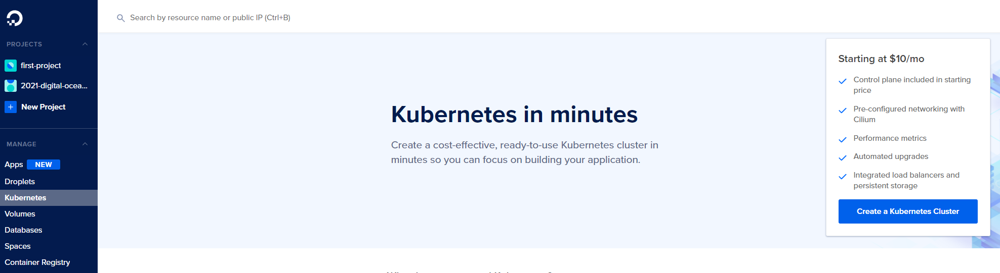
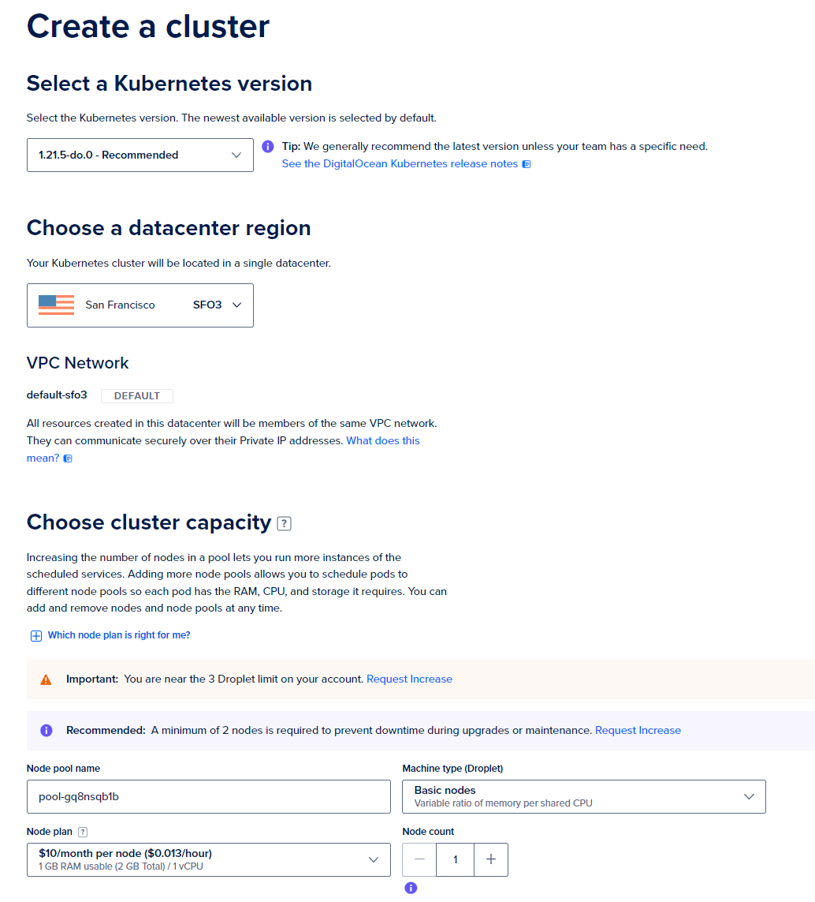
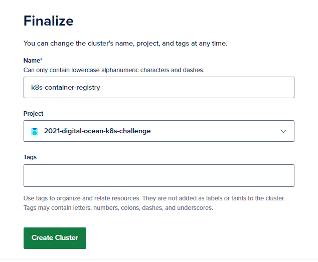
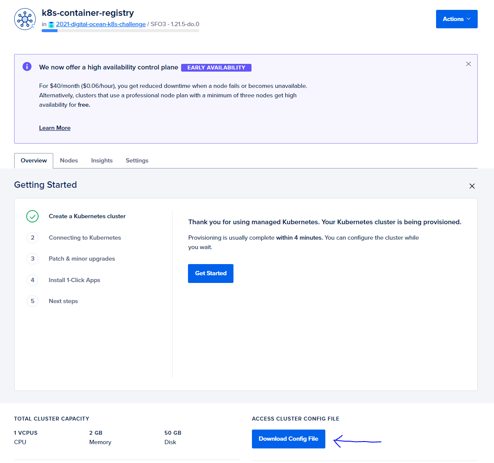
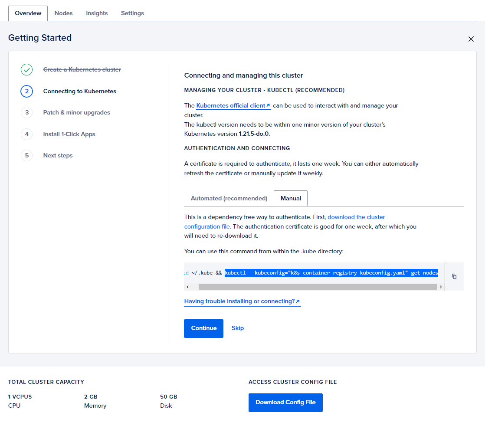
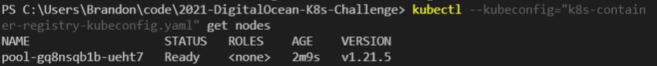
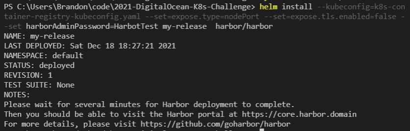
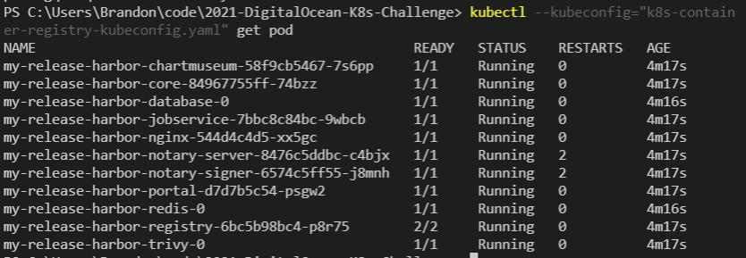
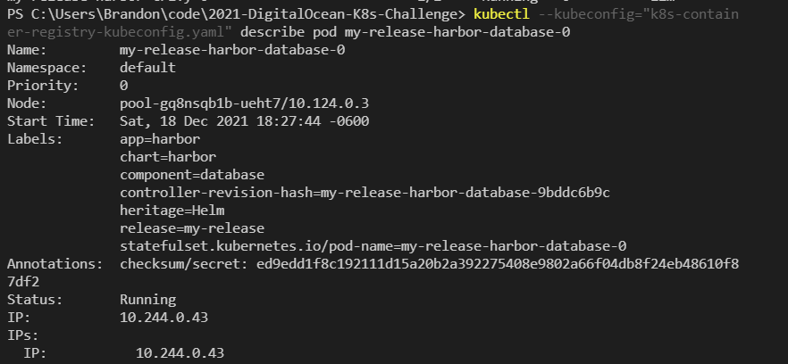

# 2021-DigitalOcean-K8s-Challenge: Project: Deploy an internal container registry on Kubernetes ##

## About me ##
I'm an automation engineer that's dipping my toes in the world of Kubernetes. I'm very much a beginner.

## Installing Prerequisites ##
Install Chocolately (Follow https://chocolatey.org/install#individual):

    Set-ExecutionPolicy Bypass -Scope Process -Force; [System.Net.ServicePointManager]::SecurityProtocol = [System.Net.ServicePointManager]::SecurityProtocol -bor 3072; iex ((New-Object System.Net.WebClient).DownloadString('https://community.chocolatey.org/install.ps1'))

Needed things to install, using Chocolately:

    choco install kubernetes-helm
    choco install kubernetes-cli
    kubectl version --client (validate kubectl installed)

## Provisioning a Kubernetes cluster on Digital Ocean ##
In Digital Ocean console, click on "Kubernetes" section under "Manage" on the blue bar on the left side.

I left the Kubernetes version at its default (1.21.5-do.0 at the time of this writing).

I selected the San Francisco datacenter.

VPC Network was left as default.

I made a couple adjustments to cluster capacity, as this is a learning exercise for me.
1. Node plan: $10/month plan (1 GB RAM, 1 vCPU per node)
2. 1 node total, instead of the recommended 3

Finally, name the cluster what you want, select the Project to place it in, and click "Create Cluster".

Provisioning the cluster takes a few minutes. 

While the cluster is being provisioned, we can download the kubeconfig yaml file to use with kubectl. At the time of writing, this file is called "k8s-container-registry-kubeconfig.yaml". Place this file where you plan on running kubectl and Helm commands.

Right above the button to download the config file, under "Getting Started" there's a guide to connecting to the cluster we just provisioned. 

Use the following command to test the connection to the Kubernetes cluster.

    kubectl --kubeconfig="YOUR/PATH/TO/k8s-container-registry-kubeconfig.yaml" get nodes

For me, this gave the following output:
PS C:\Users\Brandon\code\2021-DigitalOcean-K8s-Challenge> kubectl --kubeconfig="k8s-container-registry-kubeconfig.yaml" get nodes
NAME                   STATUS   ROLES    AGE    VERSION
pool-gq8nsqb1b-ueht7   Ready    <none>   2m9s   v1.21.5

## Deploying Harbor, an open source container registry ##

First download the Harbor helm chart:

    helm repo add harbor https://helm.goharbor.io
    helm fetch harbor/harbor --untar

Command to deploy Harbor

    helm install --kubeconfig=path/to/k8s-container-registry-kubeconfig.yaml \
    --set=expose.type=nodePort \ 
    --set=expose.tls.enabled=false \
    --set harborAdminPassword=youradminpasshere  \
    my-release  harbor/harbor

After deployment, we can run the following command to see all the pods deployed to support Harbor

    kubectl --kubeconfig="PATH/TO/k8s-container-registry-kubeconfig.yaml" get pod

At this point, Harbor is deployed!
All pods were deployed into the 10.0.0.0/8 IP space, which is a private IP range.

You can run the following command to see what IPs in this IP range for a given pod:
   
    kubectl --kubeconfig="PATH/TO/k8s-container-registry-kubeconfig.yaml" describe pod <pod name, obtained from prior command 'get pod'>

   
## Helpful links ##
1. Installing Helm: https://helm.sh/docs/intro/install/
2. Harbor: https://goharbor.io/
3. Link to this challenge!: https://www.digitalocean.com/community/pages/kubernetes-challenge
